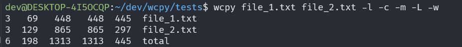

# wcpy



A `wc` clone written with Python. It is a commandline tool that reads any number of files or from stdin and returns stats about newline count, word count, and byte count depending on flags provided.

## Installation

Clone the repo and install with pipx:

```
gh repo clone https://github.com/TinySquid/wcpy.git
cd wcpy
pipx install .
```

pipx will add it to the path so you can just run it with `wcpy`. See usage for more information.

## Development

This project uses Poetry for dependency management and virtual env, black, isort, and flake8 for formatting / linting, and finally Pytest for testing.

- Install dependencies with `poetry install --with dev`
- Install pre-commit hook with `poetry run pre-commit install` to get black / isort / flake8 on commit.
  - Recommended to setup IDE specific on-save actions to use these plugins.
- Run tests with `pytest`
- Create builds with `poetry build` - will output a wheel, or you can install with `pipx install .` at the root of the project.

You can run `wcpy` with `poetry run wcpy somefile.txt -a -b -c` or from inside the virtual shell with:

```
poetry shell
...
python -m wcpy somefile.txt -a -b -c
```

## Usage

```
usage: wcpy [-h] [-c] [-m] [-l] [--files0-from=F [FILES0_FROM=F ...]] [-L] [-w] [files ...]

Print newline, word, and byte counts for each FILE, and a total line if more than one FILE is specified. A word is a non-zero-length sequence of characters delimited by white space.

positional arguments:
  files                 a file or many files separated by a space

options:
  -h, --help            show this help message and exit
  -c, --bytes           print the byte counts
  -m, --chars           print the character counts
  -l, --lines           print the newline counts
  --files0-from=F       [FILES0_FROM=F ...]
                        read input from the files specified by NUL-terminated names in file F;
                        If F is '-' then read names from standard input
  -L, --max-line-length print the maximum display width
  -w, --words           print the word counts
```

## Notes

`--files0-from=F` & reading from stdin is not supported currently.
